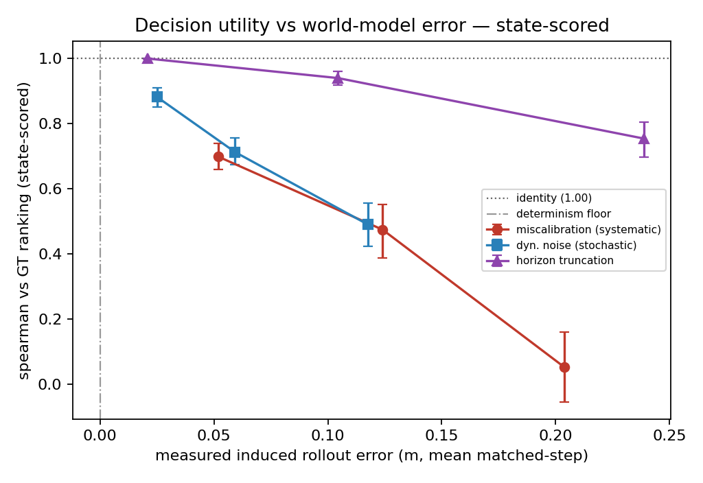
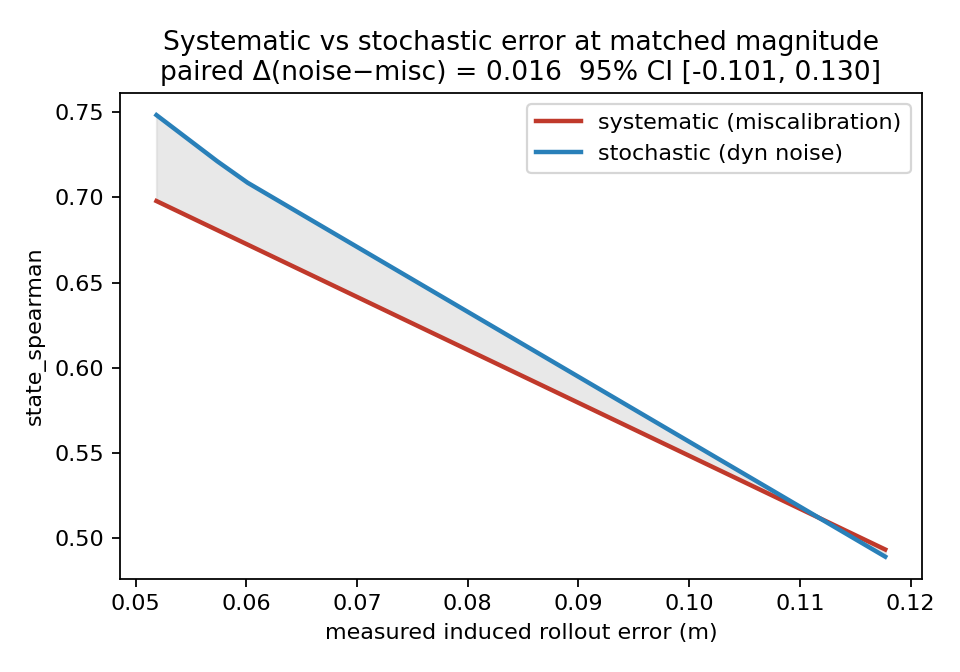

# FidelityFloor

**How good does a world model actually need to be — for an agent to pick the
right action with it?** The decision under test is the one every world-model
planner runs: choose which of K candidate plans to execute, using imagined
outcomes instead of real trials. A fidelity requirement only exists relative to
a decision like this; the study measures it with a controlled design using
Isaac Sim as a *degradable oracle*: ground truth is a pristine execution;
"imagination" is a second rollout from the same state with controlled, typed
corruption injected; downstream decision utility is measured at every fidelity
level. The deliverables are **demand curves** —
decision quality vs. *measured* world-model error, per error type — that any
real world model can later be placed on as a single validation point.

Full design: [`spec.md`](spec.md) · lab-talk slides:
[presentation](https://claude.ai/code/artifact/862ca239-aff1-4429-9545-4a572db8e418)
(source in [`presentation/`](presentation/))

## Headline results (Tier 2, state-scored, n = 30 — complete)



- **Error types are not created equal.** Horizon truncation is the most
  forgiving per meter of induced error (ρ = 0.75 with imagination stopped at 25%
  of the task); stochastic action noise degrades gracefully (0.88 → 0.49);
  systematic miscalibration collapses candidate ranking to chance (ρ ≈ 0) by
  0.20 m of induced error.
- **Bias doesn't scramble the ranking — it moves the argmax.** At matched
  measured error (miscalibration-2: 0.124 m vs dyn_noise-3: 0.118 m), rank
  correlation is statistically indistinguishable (Δρ = 0.016, CI [−0.10, 0.13])
  but **normalized top-1 regret more than doubles under systematic bias**
  (0.586 vs 0.277; paired Δ = −0.309, CI [−0.444, −0.169]). Correlated error
  moves every candidate the same way, and selection is a max operator.
  The pre-registered prediction ([`docs/preregistration.md`](docs/preregistration.md))
  is falsified on rank correlation and confirmed on selection regret.



Instrument validity, all gated before the grid ran (details in
[`REPRO_LOG.md`](REPRO_LOG.md)):

| Check | Result |
|---|---|
| Determinism floor (20-state replay, CPU PhysX) | **0.0000 m — bit-exact** |
| G1: perfect imagination recovers GT ranking | ρ = 1.000, regret = 0 |
| G2: identity condition is a no-op | bit-identical |
| G3: induced error monotone in every severity knob | 3/3 axes |
| G4: candidate spread + visual inspection | 30/30 states; contact sheets inspected |
| G5: kill-mid-shard resume; same-seed reproduction | idempotent; bit-identical |

Committed snapshot of figures + tables: [`results/`](results/). VLM-scored
column (Gemini distance-estimation scorer, validated at ρ = 0.879 on perfect
imagination) is pending an API-credit top-up; Tier 1 (spatial QA) is the
pre-committed scope cut.

## Method in one paragraph

Tabletop push-cube-to-goal in Isaac Sim 5.0 (primitive scene, velocity-controlled
cylindrical pusher, CPU PhysX for bit-exact replay + RTX rendering). Per initial
state, K = 12 open-loop candidate action chunks (expert + graded perturbations +
random). GT utility = normalized progress after pristine execution. Imagined
utility = the same chunks re-executed under one of 13 conditions — identity plus
{miscalibration, dyn_noise, horizon, obs_corruption} × 3 severities — scored (a)
from imagined final state and (b) by a VLM reading rendered imagined frames.
obs_corruption is applied post-hoc to stored pristine frames and never touches
the sim, so state-scored pipelines are blind to it *by construction*. Metrics:
Spearman ρ vs GT ranking and WorldModelGym-compatible normalized top-1 regret;
paired everywhere; bootstrap CIs (2,000 resamples) over states. Positioning vs
World-in-World / WorldModelGym / WorldSimProbe / Palenicek et al.:
[`docs/related_work.md`](docs/related_work.md).

## Repository layout

```
fidelityfloor/        launcher-agnostic core (no Modal imports; Isaac imported lazily)
  envs.py             Isaac scene: table + cube + velocity-controlled pusher + camera
  oracle.py           GT vs degraded rollouts, determinism floor
  degrade.py          the 4 axes: miscalibration / dyn_noise / obs_corruption / horizon
  candidates.py       initial states + K=12 open-loop candidates + spread check
  questions.py        Tier-1 programmatic spatial QA (verifiable answers)
  tier1.py            Tier-1 rendering + QA pass
  scoring.py          utilities, Spearman, top-1 / normalized regret
  vlm.py              VLM client (Gemini/Anthropic), content-hash response cache
  stats.py            induced error (the x-axis), paired bootstrap, matched-error
  gates.py            automated G1–G5 checks
  figures.py          demand curves, matched-error figure, contact sheets
  runner.py           shard workers shared by every launcher
run_local.py          run any stage on the current machine (used on Unity HPC)
scripts/              SLURM job scripts (smoke test + generic array-ready runner)
modal_app.py          Modal app: CPU passes (VLM scoring, analysis) + entrypoints
configs/              conditions.yaml (axes, severities, seeds) · render.yaml (frozen at P0)
docs/                 preregistration.md · related_work.md
results/              committed snapshot: final figures + tables (see results/README.md)
presentation/         slide-deck source + build script
tests/                CPU-only suite (30 tests) incl. analytic-dynamics pipeline rehearsal
REPRO_LOG.md          every pin, bug, workaround, decision — timestamped
```

## Reproducing

Everything is seeded, idempotent (skip-if-valid, atomic writes), and keyed by a
config hash, so re-runs are safe and partial runs resume. Outputs land under
`FF_OUTPUT_ROOT` (default `outputs/`).

**Local tests (no GPU):** `pip install numpy scipy pyyaml pillow pytest && pytest tests/ -q`

**Simulation (needs a GPU host with `isaacsim[all,extscache]==5.0.0`, Python 3.11):**

```bash
export FF_OUTPUT_ROOT=/path/with/space
python run_local.py smoke                      # G0: scene, render, rollout, degradation
python run_local.py determinism                # 20-state replay floor
python run_local.py shard --state-id 0         # one full state shard (13 conditions)
python run_local.py corrupt --n-states 30      # obs-corruption pass (CPU)
python run_local.py analyze --n-states 30      # stats + gates from raw arrays
```

On a SLURM cluster: `sbatch scripts/unity_run.sbatch <stage> [args]`, or the full
grid as `sbatch --array=0-29%4 scripts/unity_run.sbatch shard`.

**VLM scoring** (either launcher; responses cached by content hash so re-runs
bill zero): set `GEMINI_API_KEY` and `python run_local.py vlm --n-states 30`, or
on Modal — `modal secret create gemini-api-key GEMINI_API_KEY=...` then
`modal run modal_app.py::vlm_pass --n-states 30`. Provider/model configured in
`configs/conditions.yaml` (`vlm:` block).

> **Platform note:** Isaac's RTX renderer requires a host with unmediated GPU
> driver access. On Modal, rendering dies with `VK_ERROR_DEVICE_LOST` (gVisor
> sandbox); the sim stages therefore run on bare-metal GPUs (Unity HPC L40S in
> our runs) while Modal handles the CPU-side VLM/analysis passes. Details and
> the full debugging trail: `REPRO_LOG.md`.

## Placing a real world model on the curves

The adapter point is deliberately small: produce, for each (state, candidate),
an *imagined* trajectory `{cube_pos, pusher_pos}` (and optionally rendered
frames) in place of `oracle.run_rollout`'s degraded output, write it with
`io_utils.save_rollout` under a new condition id, and `stats.summarize` +
`figures.fig_utility_vs_error` will place the model as a point against these
curves — its measured induced error on the x-axis, its decision utility on the y.
